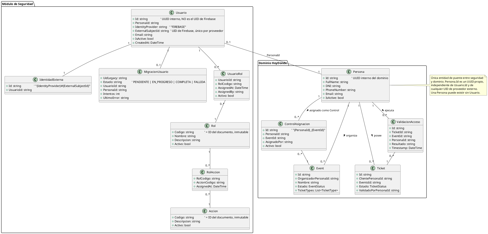

# Diseño técnico revisado: refactor del módulo de seguridad de HoyDonde?

> **Estado de implementación (2026-08-01):** Etapa 0 (abstracción `IIdentityProvider`) implementada y verificada (build + suite completa en verde). Etapas 1-7 siguen siendo diseño, no implementadas.

Documento de análisis. Incorpora las 12 correcciones que indicaste sobre la v1. No incluye código de producción, migraciones ejecutables ni cambios de frontend.

---

## 1. Diagnóstico del modelo actual

(Sin cambios respecto a la v1 — verificado contra código real, no contra documentación.)

- `ApplicationUser` (abstracta, `Role` string plano) con subclases `Admin`/`Cliente`/`Organizador`/`Control` en una sola colección `users`, discriminadas manualmente por `Role`.
- `Roles.cs`: 4 constantes string, usadas a la vez como valor persistido, custom claim de Firebase y argumento de `[Authorize(Roles=...)]`.
- Un usuario = un rol (jerarquía de subclases lo impide estructuralmente).
- `Control.EventId` es un escalar: un Control solo puede estar asignado a un evento en toda su vida.
- Bug real: `AuthService.SyncUserAsync` crea usuarios nuevos como `Organizador` por defecto y no setea `Role` ni el claim; `FirestoreUserRepository.MapDocumentToUser` cae a `Organizador` si `Role` está vacío o no matchea. Este sesgo **no se hereda** al nuevo diseño (ver §9).
- Ownership ya resuelto correctamente hoy fuera del sistema de roles (`EventService.GetOwnedEventOrThrowAsync`, `UserService.RegisterControlAsync`, `TicketService.ValidateTicketAsync`, `FirestoreTicketValidationStore.TryConsumeAsync`), patrón "nunca confiar en un id del body, releer de Firestore y comparar contra el UID del token" — se conserva el patrón, cambia el campo comparado.
- `IsAdminCreatedAsync` es un stub muerto. `IJwtService` no tiene implementación registrada (código huérfano).
- Tests 100% mockeados hoy, sin emulador de Firestore. `GetTicketsByClienteIdAsync` no tiene test de ownership.
- Frontend: `POST /auth/login` apunta a un endpoint inexistente en el backend; fuera de alcance de este refactor.

---

## 2. Modelo objetivo: identificadores separados

**Corrección obligatoria #1.** Se descarta compartir identificador. Modelo aprobado:

```text
Persona.Id:              UUID interno del dominio (generado por la aplicación, no depende de ningún proveedor externo)
Usuario.Id:               UUID interno del módulo de seguridad (generado por la aplicación)
Usuario.PersonaId:        referencia a Persona.Id
Usuario.IdentityProvider: string, inicialmente "FIREBASE"
Usuario.ExternalSubjectId:UID de Firebase — único por proveedor
```

- Una `Persona` puede existir **sin** `Usuario` (p. ej. un registro de dominio importado, o una persona dada de alta por un organizador que todavía no tiene credenciales propias).
- Todo el dominio (`Event`, `Ticket`, `ControlAsignacion`) referencia exclusivamente `Persona.Id`. Nunca UID de Firebase, nunca `Usuario.Id`.
- **Unicidad y resolución rápida sin caché** (ver §5 y corrección #3): se agrega una colección de índice inverso `identidades_externas/{IdentityProvider}#{ExternalSubjectId}` → `{ UsuarioId }`, con ID de documento determinístico. Esto permite: (a) forzar unicidad de `ExternalSubjectId` por proveedor mediante una escritura "crear si no existe", y (b) resolver "UID de Firebase → UsuarioId" en una sola lectura directa por ID, sin query, indispensable porque la corrección #3 prohíbe cachear.

### Migración de referencias existentes

Ningún campo legacy se modifica destructivamente; todo remapeo es **aditivo** (campo nuevo al lado del viejo) hasta que una etapa posterior confirme el corte:

| Campo legacy | Campo nuevo (aditivo) | Mecanismo |
|---|---|---|
| `Event.OrganizadorId` (UID Firebase) | `Event.OrganizadorPersonaId` | Se resuelve vía el mapeo `uid → PersonaId` construido durante el backfill de usuarios (Etapa 3) y se escribe como campo nuevo en cada `Event` (Etapa 4). El campo legacy no se toca. |
| `Ticket.ClienteId` (UID Firebase) | `Ticket.ClientePersonaId` | Igual mecanismo, aplicado a cada `Ticket`. |
| `Ticket.ValidadoPor` (UID Firebase del Control) | `Ticket.ValidadoPorPersonaId` | Igual mecanismo; solo aplica a tickets ya validados (`ValidadoPor` no vacío). |
| `Control.OrganizadorId` + `Control.EventId` (escalares) | Nueva fila en `control_asignaciones` con `PersonaId` (del Control) + `EventId`, `AsignadoPor` (PersonaId del organizador) | Transformación real, no solo copia: el escalar único se convierte en la primera fila de una relación muchos-a-muchos. |
| `users/{uid}` (documento completo) | `personas/{nuevoPersonaId}` + `usuarios/{nuevoUsuarioId}` + `usuarios/{nuevoUsuarioId}/roles/{RolCodigo}` + `identidades_externas/FIREBASE#{uid}` | Ver Etapa 3. El documento legacy permanece intacto; solo se le agrega un marcador de estado en una colección de control aparte (`migracion_usuarios`), nunca un campo mutado dentro del propio documento de negocio. |

Un dato "huérfano" durante el remapeo (p. ej. un `Event.OrganizadorId` que no aparece en el mapeo `uid → PersonaId` porque su organizador nunca migró o el documento está corrupto) se reporta como **fallido**, nunca se remapea a un valor arbitrario ni se omite silenciosamente.

---

## 3. IDs de roles y acciones

**Corrección obligatoria #2.** IDs de documento = código, no IDs generados con un campo `Codigo` duplicado:

```text
roles/ORGANIZADOR
acciones/EVENTO_CREAR
roles/ORGANIZADOR/acciones/EVENTO_CREAR
usuarios/{usuarioId}/roles/ORGANIZADOR
```

- El código (`Codigo` = ID del documento) es **inmutable** una vez creado. El administrador puede editar `Nombre`, `Descripcion` y `Activo`, nunca el ID.
- Cambiar el código de un rol/acción existente no es una operación soportada — requiere dar de baja el código viejo y crear uno nuevo (con sus propias reasignaciones), tratado como un cambio de catálogo, no una edición.
- Ventaja práctica: `roles/{Codigo}/acciones/{AccionCodigo}` y `usuarios/{UsuarioId}/roles/{RolCodigo}` son escrituras `Set` idempotentes por construcción (crear = mismo efecto que ya existente), sin necesidad de query previa para evitar duplicados.

---

## 4. `IPermissionService` sin caché — resolución directa contra la fuente de verdad

**Corrección obligatoria #3.** La primera implementación no cachea nada. Resolución por request (todas lecturas directas por ID, ninguna es un query de colección completa):

1. `identidades_externas/FIREBASE#{uid}` → `UsuarioId` (1 lectura).
2. `usuarios/{UsuarioId}` → si `IsActive == false`, denegar inmediatamente; obtener `PersonaId` (1 lectura).
3. `usuarios/{UsuarioId}/roles` (subcolección) → códigos de rol con asignación activa (1 lectura de subcolección, típicamente 1-3 documentos).
4. Por cada `RolCodigo` activo: `roles/{RolCodigo}` → confirmar `Activo == true` (N lecturas, N pequeño).
5. Por cada rol activo: `roles/{RolCodigo}/acciones` (subcolección) → códigos de acción habilitados (N lecturas de subcolección).
6. Por cada `AccionCodigo` recolectado (deduplicado): `acciones/{AccionCodigo}` → confirmar `Activo == true` (M lecturas, M acotado por el tamaño del catálogo tocado, no por el catálogo completo).

Total: entre ~5 y ~15 lecturas por decisión de autorización según cuántos roles/acciones tenga el usuario — aceptable como punto de partida; se deja como **optimización condicionada a mediciones reales** (no especulativas) introducir caché más adelante.

### Estrategia de caché futura (si las mediciones lo justifican)

Si se agrega caché de acciones efectivas, debe incluir **invalidación explícita e inmediata** (no solo TTL) ante:
- desactivación de `Usuario`;
- asignación o eliminación de un `UsuarioRol`;
- activación/desactivación de un `Rol`;
- asignación o eliminación de una acción de un `Rol` (`RolAccion`);
- desactivación de una `Accion`.

Cada una de estas mutaciones administrativas, en el momento de escribirse, debe invalidar explícitamente las entradas de caché afectadas (del usuario puntual, o — para cambios a nivel de Rol/Accion que afectan a muchos usuarios — una invalidación en cascada o un cambio de versión de catálogo que la caché consulte). Una revocación de seguridad **no puede depender solo de que expire un TTL**.

---

## 5. Compatibilidad segura: sin "OR", branching estricto con indicador inequívoco

**Corrección obligatoria #4.** Se descarta "legacy OR nuevo". Regla:

```text
si Usuario tiene migración completa:
    usar exclusivamente el modelo nuevo (IPermissionService + PersonaId)
si no:
    usar exclusivamente el modelo legacy (Role string + UID de subclase)
```

### Indicador inequívoco de migración completa

Colección dedicada `migracion_usuarios/{uidLegacy}` (ID = UID de Firebase, determinístico):

```jsonc
{ "Estado": "PENDIENTE | EN_PROGRESO | COMPLETA | FALLIDA",
  "UsuarioId": "...", "PersonaId": "...",
  "Intentos": 1, "UltimoError": null, "ActualizadoAt": "..." }
```

Resolución en el `AuthorizationHandler`, por request:

- No existe registro para ese `uid` → el usuario nunca fue creado por ningún flujo válido (en el modelo final, toda alta —Etapa 2 en adelante— crea este registro atómicamente junto con el resto) ⇒ **denegar (401/403)**, nunca se interpreta como "no migrado, usar legacy".
- `Estado == COMPLETA` → usar exclusivamente `IPermissionService`/`PersonaId`. Ídem para los checks de propiedad de dominio (`Event.OrganizadorPersonaId`, etc., que ya están remapeados por completo antes de que esta etapa se active — ver criterios de corte en §12).
- `Estado == PENDIENTE` → usar exclusivamente la lógica legacy (comparar el claim `role` del JWT contra el rol legacy requerido para esa Accion, tabla de equivalencia fija).
- `Estado == EN_PROGRESO` o `FALLIDA` → **fail-closed**: denegar y registrar para atención operativa. Nunca se asume un rol por defecto ni se reintenta silenciosamente contra ninguno de los dos modelos.

En la práctica, la Etapa 5 (activación de este branching) no arranca hasta que el backfill (Etapas 3-4) reporta **cero** usuarios en `PENDIENTE`/`EN_PROGRESO`/`FALLIDA` (ver criterios verificables, §12) — por lo que la rama legacy es una red de seguridad que en producción se espera que nunca se ejercite, no un sistema paralelo de larga vida.

---

## 6. Abstracción de proveedor de identidad — etapa previa a la doble escritura

**Corrección obligatoria #5.** Antes de tocar `UserService` para el modelo nuevo, se introduce:

```text
IIdentityProvider
  CreateIdentityAsync(email, password) -> { ExternalSubjectId, IdentityProvider }
  DeleteIdentityAsync(externalSubjectId)                      // compensación
  SetActiveAsync(externalSubjectId, isActive)
  UpdateAttributesAsync(externalSubjectId, attrs)
  GeneratePasswordResetLinkAsync(externalSubjectId)            // reservado para flujo futuro de invitación
  SetTemporaryClaimAsync(externalSubjectId, claims) / ClearClaimAsync(...)   // solo mientras dure la compatibilidad legacy (§9)
```

`FirebaseIdentityProvider` es la única implementación inicial. `UserService` deja de llamar a `FirebaseAuth.DefaultInstance` directamente.

**Implementado en esta sesión** (Etapa 0 — ver §14): `HoyDonde.API/Services/IIdentityProvider.cs` y `HoyDonde.API/Services/FirebaseIdentityProvider.cs`, con `UserService` refactorizado para depender de la interfaz. Comportamiento observable idéntico al anterior; suite completa (42 tests) en verde.

### Comportamiento ante fallos parciales

1. **Firebase crea la identidad y Firestore falla**: se captura la excepción de Firestore y se invoca `DeleteIdentityAsync` como compensación. Si la compensación también falla, se registra en una colección de reconciliación (`identidades_huerfanas`) para revisión manual — nunca queda un `Usuario` a medio crear en Firestore, porque la escritura Firestore es una transacción atómica (ítem 2).
2. **Firestore escribe parcialmente**: estructuralmente imposible por diseño — `Persona` + `Usuario` + `UsuarioRol` inicial + `identidades_externas` + `migracion_usuarios` (cuando aplica) se escriben en **una sola transacción** (`RunTransactionAsync`). Todo o nada.
3. **Falla la asignación inicial del rol**: al estar dentro de la misma transacción que el ítem 2, no puede fallar de forma aislada — o se crea el usuario completo con su rol, o no se crea nada.
4. **Reintento de una operación parcialmente completada**: antes de llamar `CreateIdentityAsync`, se verifica si ya existe una identidad para ese email (Firebase impone unicidad de email de forma nativa). Si `CreateIdentityAsync` falla por "ya existe", se recupera el `ExternalSubjectId` existente y se reintenta **solo** la transacción Firestore, que es naturalmente idempotente porque revisa `migracion_usuarios.Estado` (o la existencia previa del `Usuario`) antes de escribir — repetir la operación con el mismo insumo no duplica nada.

`PersonaId` y `UsuarioId` se generan como UUID en la aplicación **antes** de iniciar la transacción, de modo que puedan referenciarse entre sí dentro de la misma escritura atómica.

---

## 7. Administración de roles y acciones — etapa propia

**Corrección obligatoria #6.** Diseño de endpoints/DTOs/servicios/reglas (sin implementar):

| Endpoint | Accion requerida | DTO entrada | DTO salida |
|---|---|---|---|
| `POST /api/roles` | `ROL_CREAR` | `CrearRolRequest{Codigo,Nombre,Descripcion}` | `RolResponse` |
| `PUT /api/roles/{codigo}` | `ROL_EDITAR` | `EditarRolRequest{Nombre,Descripcion}` (Codigo no editable) | `RolResponse` |
| `PATCH /api/roles/{codigo}/estado` | `ROL_ACTIVAR` | `{Activo: bool}` | `RolResponse` |
| `POST /api/roles/{codigo}/acciones/{accionCodigo}` | `ROL_ASIGNAR_ACCION` | — | 204 |
| `DELETE /api/roles/{codigo}/acciones/{accionCodigo}` | `ROL_QUITAR_ACCION` | — | 204 |
| `POST /api/usuarios/{usuarioId}/roles/{rolCodigo}` | `USUARIO_ASIGNAR_ROL` | — | 204 |
| `DELETE /api/usuarios/{usuarioId}/roles/{rolCodigo}` | `USUARIO_QUITAR_ROL` | — | 204 |
| `GET /api/usuarios/{usuarioId}/permisos-efectivos` | `USUARIO_VER_PERMISOS_EFECTIVOS` | — | `PermisosEfectivosResponse{UsuarioId,PersonaId,Roles[],Acciones[]}` |
| `PATCH /api/usuarios/{usuarioId}/estado` | `USUARIO_DESACTIVAR` | `{Activo: bool}` | 204 |

### Regla de negocio: no perder el último acceso administrativo efectivo

Antes de completar cualquiera de estas operaciones si el objetivo es un Usuario con rol `ADMINISTRADOR` activo (quitar el rol, desactivar el usuario, desactivar el rol `ADMINISTRADOR` globalmente, o quitarle al rol `ADMINISTRADOR` la última acción crítica de administración): se cuenta, **dentro de la misma transacción que aplica el cambio**, cuántos Usuarios activos tienen hoy una asignación activa de `ADMINISTRADOR` con el rol `ADMINISTRADOR` a su vez activo. Si la operación llevaría ese conteo a cero, se rechaza (`UltimoAdministradorException`, 409). Hacerlo dentro de la transacción evita condiciones de carrera entre dos desactivaciones concurrentes que individualmente parecen seguras pero en conjunto dejan el sistema sin administradores.

### ¿Acciones administrables por API o catálogo de desarrollo?

**Decisión: las Acciones son un catálogo controlado por desarrollo** (sembrado vía la herramienta de migración/seed, versionado con el código, requiere revisión de código). Justificación: cada `Accion` solo tiene sentido si existe una comprobación de código real (`[Authorize(Policy="X")]`) que la consuma — crear una Accion nueva por API sin el código correspondiente desplegado sería una entidad sin efecto, o peor, una ilusión de control. Sí son editables/activables por API (`Descripcion`, `Activo` como kill-switch operativo), pero el **código** y su existencia inicial se define en el repositorio.

Los **Roles**, en cambio, sí son administrables de punta a punta por API (crear/editar/activar/asignar acciones) porque son simplemente paquetes nombrados de Acciones ya existentes y con código ya desplegado — un Rol nuevo no requiere ningún cambio de código para tener efecto.

---

## 8. Pruebas con Firestore Emulator

**Corrección obligatoria #7.** Se introduce el emulador desde la Etapa 1 (primera etapa con repositorios nuevos), no se pospone. Cuatro capas explícitamente separadas:

1. **Unitarias de servicios contra interfaces** — repositorios mockeados, sin Firestore, foco en lógica de negocio (p. ej. reglas de "último administrador", branching migrado/no-migrado).
2. **Autorización HTTP** — patrón actual (`TestApplicationFactory` + `FakeAuthHandler`, servicios mockeados), ampliado para simular estados de migración (`COMPLETA`/`PENDIENTE`/`FALLIDA`) y para permitir múltiples roles por principal de prueba (hoy `FakeAuthHandler` solo admite un `Test-Role`).
3. **Integración de repositorios contra el emulador** — `FirestoreRolRepository`, `FirestoreUsuarioRepository`, etc. corriendo contra `FIRESTORE_EMULATOR_HOST` real: transacciones, batches, unicidad de `identidades_externas`, índices compuestos de `control_asignaciones`.
4. **Del migrador, contra el emulador** — dry-run, ejecución real, idempotencia (correr dos veces no duplica), reanudación tras interrupción simulada, datos legacy corruptos (sin `Role`, con `Role` desconocido) que deben quedar `FALLIDA` y nunca asumir un rol por defecto.

Se descarta explícitamente mockear el SDK de Firestore como sustituto de pruebas de persistencia — un mock valida ramificación de lógica de servicio, no el comportamiento real de transacciones/índices/queries, que es justo donde se esconden los bugs de migración y concurrencia.

---

## 9. `ControlAsignacion`

**Corrección obligatoria #8.** Colección top-level `control_asignaciones`, ID de documento **determinístico**: `{PersonaId}_{EventId}` — hace que "asignar Control a Evento" sea un `Set` idempotente (crear o reactivar) y evita estructuralmente duplicados para el mismo par, sin necesidad de query previa.

```jsonc
// control_asignaciones/{personaId}_{eventId}
{ "PersonaId": "...", "EventId": "...", "AsignadoPor": "...", "AsignadoAt": "...",
  "Activo": true, "DesactivadoAt": null, "DesactivadoPor": null }
```

Índices necesarios:
- **Eventos activos asignados a una Persona**: índice compuesto `(PersonaId ASC, Activo ASC)`.
- **Controles activos asignados a un Evento**: índice compuesto `(EventId ASC, Activo ASC)`.

Comprobación de autorización para validar un ticket: el usuario debe tener la Accion `TICKET_VALIDAR` (vía `IPermissionService`, ítem de rol) **y además** una lectura directa de `control_asignaciones/{PersonaId}_{eventId}` con `Activo == true` (lectura por ID determinístico, O(1), sin query — coherente con "sin caché" de §4, porque el par ya es conocido en el momento del request).

---

## 10. Custom claims — estado final

**Corrección obligatoria #9.**

- El claim `role` se mantiene **únicamente** durante la ventana de compatibilidad legacy (mientras existan usuarios en `Estado != COMPLETA`), gestionado a través de `IIdentityProvider.SetTemporaryClaimAsync`/`ClearClaimAsync` (§6) para poder retirarlo sin volver a tocar `UserService`.
- Modelo final: el token de Firebase identifica únicamente al sujeto externo (`ExternalSubjectId`); Firestore decide `Usuario`, roles y acciones; el claim `role` se elimina por completo.
- `/auth/sync` (o su reemplazo) deja de crear usuarios "sobre la marcha": en el modelo nuevo, toda alta de identidad crea su `Usuario`+`Persona`+rol inicial de forma atómica en el mismo paso (§6) — un `ExternalSubjectId` autenticado sin `Usuario` correspondiente representa una alta fallida/comprensada o un token inesperado, nunca un caso válido de "crear ahora". Por lo tanto el endpoint pasa a ser de solo lectura ("resolver mi Usuario/Persona/roles actuales"); si no existe `Usuario`, responde 404 ("no registrado") en vez de crear nada.
- Ninguna identidad nueva obtiene privilegios salvo a través del flujo público explícito de registro de Cliente (que crea Persona+Usuario+UsuarioRol(CLIENTE) en un solo paso deliberado) o de un flujo administrativo explícito (Admin/Organizador/Control, siempre iniciado por alguien con la Accion correspondiente).

---

## 11. `ValidacionAcceso` — auditoría, etapa posterior

**Corrección obligatoria #10.** Se mantiene fuera del núcleo inmediato de autorización (la máquina de estados `Ticket.Estado`/`FechaUso`/`ValidadoPorPersonaId` sigue siendo el mecanismo que garantiza uso único). Se agrega como etapa posterior obligatoria de auditoría (Etapa 6):

- Colección nueva `validaciones_acceso/{id}`: `TicketId, EventId, PersonaId, Resultado (Exitoso|Rechazado), Motivo?, Timestamp`.
- **Intento exitoso**: el registro de auditoría se escribe **dentro de la misma transacción** (`RunTransactionAsync`) que ya consume el ticket en `FirestoreTicketValidationStore.TryConsumeAsync` — un `Set` adicional sobre el mismo transaction scope. Si la transacción reintenta (conflicto de concurrencia), el intento de escritura de auditoría se descarta y reintenta junto con el resto; nunca puede quedar un registro de éxito sin el consumo real del ticket, ni viceversa.
- **Intento rechazado** (rol/accion insuficiente, evento equivocado, ya usado, anulado): se escribe fuera de la transacción de consumo (no hay estado concurrente que proteger en un rechazo), inmediatamente al determinarse el motivo.

---

## 12. Herramienta de migración

**Corrección obligatoria #11.** Proyecto de consola separado dentro de la solución (no un endpoint HTTP, no un comando oculto de la API). Requisitos:

- `--dry-run`: calcula y reporta cambios sin escribir.
- Ejecución idempotente: correr dos veces no duplica (se apoya en `migracion_usuarios.Estado` y en la presencia de campos/documentos ya migrados).
- Reanudación: retoma desde donde se interrumpió, usando el estado persistido por documento.
- Reporte por corrida: cantidades de migrados / omitidos (ya migrados) / fallidos, con el ID de documento y motivo de cada falla.
- Modo `--validate` (post-migración): re-escanea todos los documentos legacy y confirma 100% de `COMPLETA` y 100% de campos remapeados en `Event`/`Ticket`/`ControlAsignacion`; termina con código de salida distinto de cero si encuentra algún faltante — utilizable como gate de CI/operaciones antes de activar la Etapa 5.
- Entorno explícito obligatorio: `--environment=staging|production`, sin valor por defecto.
- Rechazo de ejecución accidental: `--expected-project=<id>` obligatorio, comparado contra el `Firebase:ProjectId`/`GOOGLE_CLOUD_PROJECT` configurado; si no coinciden, aborta antes de cualquier lectura o escritura.

---

## 13. Criterios verificables de transición (reemplazan "burn-in")

**Corrección obligatoria #12.** Sin plazos arbitrarios. Antes de activar cada etapa que depende de la anterior, y antes de la Etapa 7 (retiro final) en particular, deben cumplirse **todos**:

- Suite completa aprobada (unitarias + HTTP + integración contra emulador + pruebas del migrador).
- `--validate` del migrador reporta cero `PENDIENTE`/`EN_PROGRESO`/`FALLIDA` y cero documentos `Event`/`Ticket`/`Control` sin remapear.
- Cero documentos parciales detectados (ninguna transacción a medio completar según los marcadores de estado).
- Cero usos registrados de la rama legacy del `AuthorizationHandler` durante una corrida de verificación (requiere instrumentar esa rama con un log/métrica que se audita antes de avanzar; "cero" significa que ese contador no se incrementó ni una vez durante toda la verificación).
- Smoke test manual documentado antes del retiro definitivo (Etapa 7): login de cada uno de los 4 roles, una acción representativa por rol (200), un intento cruzado de ownership (evento/ticket ajeno → 403).

---

## 14. Plan incremental de implementación (versión revisada)

### Etapa 0 — Abstracción de proveedor de identidad — **IMPLEMENTADA (2026-08-01)**
- **Objetivo**: desacoplar `UserService` de `FirebaseAuth.DefaultInstance` sin cambiar comportamiento observable.
- **Componentes**: `IIdentityProvider`, `FirebaseIdentityProvider`, refactor de `UserService` (§6).
- **Persistencia**: ninguna nueva.
- **Atómico/compensación**: N/A todavía — se define aquí el contrato que usarán las etapas siguientes.
- **Pruebas**: la suite actual debe seguir en verde sin cambiar aserciones (mock de `IIdentityProvider` en vez de Firebase Admin SDK directo).
- **Criterio de finalización**: cero referencias directas a `FirebaseAuth.DefaultInstance` fuera de `FirebaseIdentityProvider`.
- **Rollback**: revertir el refactor; sin datos involucrados, bajo riesgo.
- **Resultado real**: `dotnet build` sin errores, `dotnet test` 42/42 en verde. Archivos: `HoyDonde.API/Services/IIdentityProvider.cs`, `HoyDonde.API/Services/FirebaseIdentityProvider.cs`, `HoyDonde.API/Services/UserService.cs`, `HoyDonde.API/Program.cs`, `HoyDonde.API.Tests/UserServiceControlOwnershipTests.cs`.

### Etapa 1 — Catálogo Rol/Accion + Firestore Emulator en la suite
- **Objetivo**: `Rol`/`Accion` como entidades persistentes con ID = Codigo (§3); introducir el emulador (§8).
- **Componentes**: `Models/Rol.cs`, `Models/Accion.cs`, `IRolRepository`/`FirestoreRolRepository`, análogos de Accion; nueva categoría de test de integración contra emulador.
- **Persistencia**: `roles/{Codigo}`, `acciones/{Codigo}`, `roles/{Codigo}/acciones/{AccionCodigo}`.
- **Atómico**: creación de un documento único es atómica por definición; asignar acción a rol es un `Set` idempotente.
- **Pruebas**: unitarias de repos (mock), integración contra emulador (incluye rechazo de Codigo duplicado), seed idempotente del catálogo base verificado en emulador.
- **Criterio de finalización**: catálogo sembrado y verificado; ningún endpoint depende de esto todavía.
- **Rollback**: borrar las colecciones nuevas.

### Etapa 2 — Persona + Usuario con IDs separados, doble escritura transaccional
- **Objetivo**: cada alta (vía `IIdentityProvider`) crea `Persona` (UUID nuevo) + `Usuario` (UUID nuevo, `ExternalSubjectId`/`IdentityProvider`) + `UsuarioRol` inicial + `identidades_externas` + `migracion_usuarios.Estado=COMPLETA`, todo en una transacción, sin dejar de escribir `users/{uid}` legacy.
- **Componentes**: `Models/Persona.cs`, `Models/Usuario.cs`, `Models/UsuarioRol.cs`, `identidades_externas`, `migracion_usuarios`, `IPermissionService`/`PermissionService` (sin caché, §4), cambios aditivos en `UserService.RegisterXxxAsync`.
- **Persistencia**: `personas`, `usuarios`, `usuarios/{id}/roles`, `identidades_externas`, `migracion_usuarios`.
- **Atómico/compensación**: los 4 escenarios de fallo descritos en §6, ítems 1-4.
- **Pruebas**: `PermissionService` contra el catálogo de la Etapa 1 (emulador); transacción combinada (éxito, fallo simulado de Firestore con compensación en Firebase, reintento tras fallo por email duplicado).
- **Criterio de finalización**: toda alta nueva deja rastro atómico y completo en ambos modelos; `PermissionService` responde correctamente sin caché.
- **Rollback**: dejar de invocar la transacción nueva; borrar colecciones nuevas.

### Etapa 3 — Backfill de usuarios existentes
- **Objetivo**: migrar cada `users/{uid}` a `Persona`+`Usuario`+`identidad_externa`+`UsuarioRol`, construyendo el mapeo `uid → PersonaId`.
- **Componentes**: herramienta de consola (§12), comando `migrate-users`.
- **Persistencia**: mismas colecciones de la Etapa 2, pobladas para usuarios preexistentes; `migracion_usuarios/{uid}` pasa de `PENDIENTE` a `COMPLETA`/`FALLIDA`.
- **Atómico**: una transacción por usuario; un fallo en un usuario no afecta a los demás (unidades independientes).
- **Pruebas**: dry-run no escribe; ejecución real crea lo esperado; segunda ejecución no duplica; interrupción simulada a mitad de camino y reanudación correcta; datos legacy corruptos (`Role` vacío o desconocido) quedan `FALLIDA` con motivo, nunca asumidos con un rol por defecto.
- **Criterio de finalización**: `--validate` reporta 0 usuarios en `PENDIENTE`/`EN_PROGRESO`/`FALLIDA`.
- **Rollback**: borrar `personas`/`usuarios`/`identidades_externas`/`migracion_usuarios`; `users` legacy intacto.

### Etapa 4 — Remapeo de claves foráneas (Event/Ticket/Control)
- **Objetivo**: agregar `OrganizadorPersonaId` a cada `Event`, `ClientePersonaId`/`ValidadoPorPersonaId` a cada `Ticket`, y crear `control_asignaciones` a partir de cada `Control` legacy, usando el mapeo de la Etapa 3.
- **Componentes**: mismo proyecto de consola, comando `remap-domain-keys`.
- **Persistencia**: campos nuevos aditivos en `events`/`tickets` (legacy intacto); nueva colección `control_asignaciones` (§9).
- **Atómico**: una escritura por documento (un campo nuevo) es atómica; se procesa en lotes (`batch`, ≤500 operaciones) sin que un lote fallido afecte lotes ya confirmados.
- **Pruebas**: remapeo contra emulador con datos sembrados; un organizador/cliente sin entrada en el mapeo (huérfano) se reporta `FALLIDO`, nunca se remapea a un valor arbitrario.
- **Criterio de finalización**: `--validate` reporta 100% de `events`/`tickets` con campos nuevos poblados y 100% de `Control` legacy con su `ControlAsignacion`.
- **Rollback**: los campos nuevos son aditivos; ignorarlos o borrarlos no afecta el modelo legacy, único leído para autorización hasta la Etapa 5.

### Etapa 5 — Autorización por política (branching estricto) + administración de roles/acciones
- **Objetivo**: `AuthorizationHandler` que resuelve `identidades_externas` → `migracion_usuarios.Estado` y bifurca según §5 (nunca OR); endpoints de administración de §7.
- **Componentes**: `AuthorizationHandler`, registro de políticas por Accion en `Program.cs`, migración controller-por-controller de `[Authorize(Roles=...)]` a `[Authorize(Policy="ACCION_CODIGO")]`; nuevos controllers/DTOs/servicios de administración.
- **Persistencia**: sin colecciones nuevas más allá de auditoría de cambios (`security_audits`, generalización del patrón actual de `user_audits`).
- **Atómico**: el guard de "último Administrador" (§7) se evalúa y aplica dentro de una misma transacción.
- **Pruebas**: HTTP — migrado+permiso (200), migrado sin permiso (403), no-migrado con rol legacy válido (200), no-migrado sin rol legacy (403), estado inconsistente (403 fail-closed); administración — crear/editar/activar rol, asignar/quitar acción, asignar/quitar rol, consultar permisos efectivos, intento de dejar cero administradores (rechazado), concurrencia de dos desactivaciones simultáneas.
- **Criterio de finalización**: todos los endpoints del catálogo de acciones migrados; suite de administración en verde; instrumentación de la rama legacy lista para el criterio de corte.
- **Rollback**: por endpoint — revertir el atributo puntual; los endpoints de administración nuevos se pueden ocultar sin afectar el resto.

### Etapa 6 — `ValidacionAcceso` (auditoría) y retiro del claim `role`
- **Objetivo**: auditar cada intento de validación sin romper la atomicidad de uso único (§11); eliminar el claim `role` (§10).
- **Componentes**: colección `validaciones_acceso`; escritura de éxito dentro de la transacción de `TryConsumeAsync`; escritura de rechazo fuera de ella; remoción de `SetTemporaryClaimAsync("role", ...)`.
- **Persistencia**: `validaciones_acceso/{id}`.
- **Atómico**: el registro de éxito viaja en el mismo `RunTransactionAsync` que consume el ticket — no puede haber auditoría de un consumo que no ocurrió, ni viceversa.
- **Pruebas**: validación exitosa deja exactamente un registro y un ticket `Usado`; validación concurrente duplicada reintenta la transacción sin duplicar el registro de éxito; ausencia total del claim `role` no rompe ninguna decisión de autorización.
- **Criterio de finalización**: 100% de intentos (éxito y rechazo) auditados; cero lecturas del claim `role` en el código.
- **Rollback**: dejar de escribir en `validaciones_acceso` no afecta el negocio; el claim podría reintroducirse si apareciera un consumidor externo no detectado hasta ahora.

### Etapa 7 — Retiro del modelo legacy
- **Objetivo**: eliminar `ApplicationUser`/subclases, `Roles.cs`, la rama legacy del `AuthorizationHandler`; dejar de escribir/leer `users` en producción (sin borrar la colección).
- **Componentes**: borrado de `Models/Admin.cs`, `Cliente.cs`, `Organizador.cs`, `Control.cs`, `Roles.cs`; simplificación del `AuthorizationHandler` a una sola rama; borrado del doble-write en `UserService`.
- **Persistencia**: `users` se deja de leer/escribir pero no se borra (ventana de auditoría/rollback de datos).
- **Compatibilidad**: se rompe intencionalmente — solo se ejecuta cuando se cumplen **todos** los criterios verificables de §13, no un plazo de tiempo.
- **Pruebas**: regresión completa (unitarias + HTTP + emulador); retiro de tests que solo cubrían la rama dual.
- **Criterio de finalización**: cero referencias a `Roles.cs`/subclases de `ApplicationUser` en código de producción.
- **Rollback**: el más costoso — mitigado por no borrar `users`, permitiendo inspección de datos aun después de borrar el código.

---

## 15. Diagrama de clases (PlantUML, actualizado)



---

## 16. Catálogo inicial de roles y acciones (sin cambios de fondo respecto a v1)

Roles: `ADMINISTRADOR`, `CLIENTE`, `ORGANIZADOR`, `CONTROL` (IDs de documento = estos mismos códigos, §3).

Acciones de paridad con endpoints existentes: `USUARIO_CREAR_ADMIN`, `USUARIO_CREAR_ORGANIZADOR`, `CONTROL_CREAR`, `EVENTO_CREAR`, `EVENTO_EDITAR_PROPIO`, `EVENTO_PUBLICAR_PROPIO`, `EVENTO_CANCELAR_PROPIO`, `EVENTO_VER_PROPIOS`, `TICKET_COMPRAR`, `TICKET_VER_PROPIO`, `TICKET_VALIDAR`.

Acciones de administración (§7): `ROL_CREAR`, `ROL_EDITAR`, `ROL_ACTIVAR`, `ROL_ASIGNAR_ACCION`, `ROL_QUITAR_ACCION`, `USUARIO_ASIGNAR_ROL`, `USUARIO_QUITAR_ROL`, `USUARIO_VER_PERMISOS_EFECTIVOS`, `USUARIO_DESACTIVAR`.

No se incluye `EVENTO_VER_ANALITICAS`: no hay endpoint de analíticas implementado hoy; se reserva el código para cuando la funcionalidad exista.

---

## 17. Decisiones ya resueltas por tus correcciones (registro, no pendientes)

1. Identificadores separados (Persona/Usuario/UID externo) — resuelto, §2.
2. IDs de Rol/Accion = código inmutable — resuelto, §3.
3. Sin caché inicial — resuelto, §4.
4. Sin "OR" en compatibilidad, branching fail-closed — resuelto, §5.
5. `IIdentityProvider` como etapa previa — resuelto, §6.
6. Acciones = catálogo de desarrollo, Roles = administrables por API — resuelto y justificado, §7.
7. Emulador desde la Etapa 1, en 4 capas separadas — resuelto, §8.
8. `control_asignaciones` top-level con ID determinístico — resuelto, §9.
9. Claim `role` solo durante compatibilidad, luego eliminado; `/auth/sync` pasa a ser de solo lectura — resuelto, §10.
10. `ValidacionAcceso` como etapa de auditoría posterior, sin romper la transacción de uso único — resuelto, §11.
11. Migrador como proyecto de consola con dry-run/idempotencia/reanudación/validación/entorno explícito/verificación de proyecto — resuelto, §12.
12. Burn-in reemplazado por criterios verificables — resuelto, §13.

Pendiente real de tu parte: ninguna decisión abierta en esta versión — si alguno de los puntos anteriores no refleja lo que querías, indicalo puntualmente y ajusto solo esa sección.
